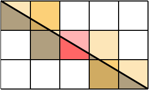

# B - Diagonal Cut

🔗 Link: https://open.kattis.com/problems/diagonalcut

## Short Description

You have a piece of rectangular chocolate and it can be seen as a grid of size $M\times N$.
Each grid cell is a chocolate block with an identical shape and size.
If you cut the entire chocolate diagonally, how many blocks will be cut into exactly two pieces of the same area?

* $1\le M, N\le 10^{18}$

## Analysis

Let $g=\text{gcd}(M, N)$ be the greatest common divisor of $M$ and $N$.
We first observe that the entire chocolate can be divided into $g\times g$ subgrids.
Moreover, the diagonal cut must pass through exactly the diagonals of $g$ subgrids.
Hence, it suffices for us to count the number of blocks that is divided into two pieces of the same area for chocolate of size $\frac{M}{g}\times \frac{N}{g}$.

Now, there is a crucial observation: if the rectangle dimensions are coprime $\text{gcd}(M, N)=1$, then the answer is $1$ if and only if both $M$ and $N$ are odd numbers.



The proof is actually not complicated. It uses the fact that **any** line cutting a rectangle into two pieces of the same area must passing through **its center**.
Let us put the entire chocolate into a cartesian plane so it lies at $(0, 0)$ and $(M, N)$.
Let $(x, y)$ be the lower-left coordinate of a block.
Suppose that the diagonal cut is a line segment from $(0, 0)$ to $(M, N)$.
Then any small block which the diagonal cut passes its center satisfies
$$
\frac{x+0.5}{y+0.5} = \frac{M}{N}.
$$

To solve the above equation, we rewrite the above expression as
$$
My-Nx=0.5 (N-M).
$$
Notice that since both $x$ and $y$ are integers, $N-M$ **must** be an even number in order to have a solution.
This implies that whenever any of $N$ or $M$ is an even number, there will be $0$ solutions.
Now, assume that both $N$ and $M$ are odd, this is a diophantine equation.
When $\text{gcd}(M, N)=1$, there is a unique solution $(x=\frac{M-1}{2}, y=\frac{N-1}{2})$, and hence the center block.

In conclusion, the answer is either $0$ or $g$, depending on whether both $M/g$ and $N/g$ are odd.

## Sample Code

import Tabs from '@theme/Tabs';
import TabItem from '@theme/TabItem';

<Tabs groupId="lang">
<TabItem value="py" label="Python 3">

```py showLineNumbers
from math import gcd

M, N = map(int, input().split())
g = gcd(M, N)
if M//g%2==0 or N//g%2==0:
  print("0")
else:
  print(g)
```

:::tip
Make sure you use integer division `//` before modulo `%`.
Otherwise you will get wrong answer as **float** is not precise enough.
:::

</TabItem>
<TabItem value="cpp" label="C++">

```cpp showLineNumbers
#include <bits/stdc++.h>
using namespace std;

int main() {
  long long M, N;
  cin >> M >> N;
  long long g = gcd(M, N);
  if (M/g%2==0 || N/g%2==0) {
    cout << "0\n";
  } else {
    cout << g << '\n';
  }
  return 0;
}
```

</TabItem>
</Tabs>
